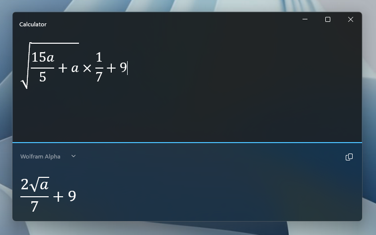

# Calculator

Modern expression-based calculator app made for Windows (WinUI 3) with visual math expression editor and support for multiple engines:

- **Decimal**: 128-bit decimal floating-point arithmetic
- **Big Integer**: Arbitrary-precision integer arithmetic
- **Wolfram Alpha**: Query Wolfram Alpha for results
